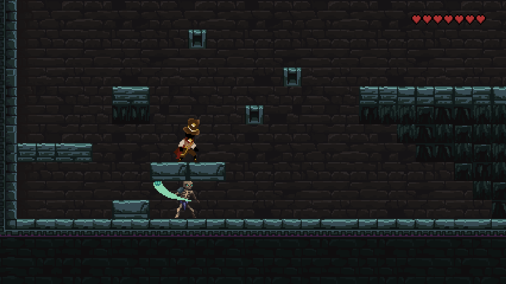
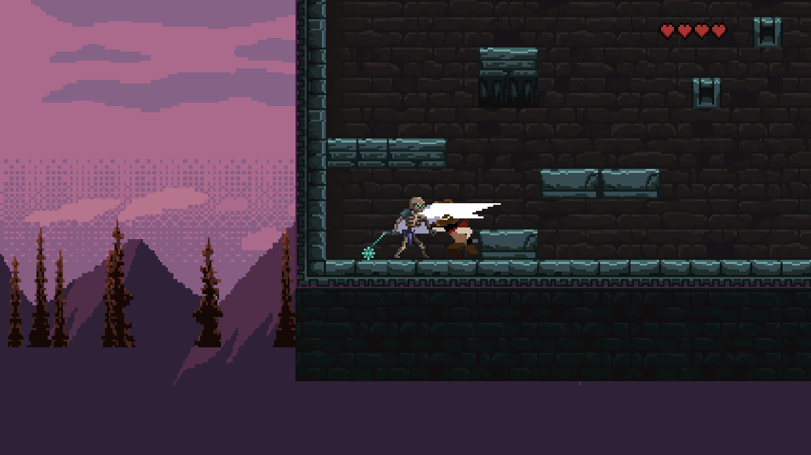

# Платформер "SouL"

Семестровый проект студентов первого курса ЛФИ МФТИ 

## Описание игры

Проект представляет собой платформер, в котором необходимо сражаться с врагами и проходить уровни, чтобы выжить.


## Инструкция по установке

1. Установите **Python** с [этого](https://www.python.org/downloads/) сайта.
2. Склонируйте репозиторий к себе на компьютер. Для этого откройте терминал (консоль) **GNU/Linux** или командную строку
**Git-bash** под **MS Windows** и выполните команду:
    ```
    git clone https://github.com/LarkTit/DGAP_Project_10.git
    ```
3. Для запуска программы перейдите в склонированный репозиторий и запустите файл `main.py`.
4. Готово!


### Игровой процесс

1. Вы появляетесь в качестве персонажа, владеющего клинком, умеющего карабкаться, бегать, прыгать, кувыркаться

    


2. Вы можете перемещаться вправо влево с помощью кнопок "d", "a" соответсвенно. Прыжок на кнопку "space". Для того чтобы нанести удар нажмите один раз ЛКМ. Для того чтобы сделать комбинацию из двух ударов кликните два раза ЛКМ.

3. После начала игры необходимо убивать мобов, чтобы пройти на следующщий уровень. После прохождения зараннее зафиксированного количества волн, игрок переходит на следующий уровень.

4. Цель игры - убить как больше врагов, чтобы пройти все уровни.

5. Враги представляют из себя скелетов, которые могут бить булавой, а также воронов, которые бьют своим "хитбоксом"



6. У персонажа 7 жизней, по истечению которых, игрок проигрывает.


7. В случае проигрыша написано game over на весь экран и игра закрывается.


## Обратная связь

Мы очень рады, если вы решили поиграть в нашу игру. Мы ценим это! Оставить отзывы и пожелания по поводу игры можно в папке issues.
